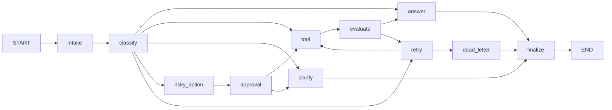

# Báo Cáo Thực Hành Lab 08 — LangGraph Agentic Orchestration

## 1. Thông tin nhóm / sinh viên (Team / student)

- **Tên nhóm:** Fable 3.6
- **Danh sách thành viên:**
  1. **Lưu Quang Nhật** — MSSV: `2A202601920`
  2. **Nguyễn Ngọc Sơn** — MSSV: `2A202601948`
  3. **Lê Tuấn Hiệp** — MSSV: `2A202601667`  
  4. **Trần Doãn Hưng** — MSSV: `2A202601143`
- **Repo / Commit:** https://github.com/luunhatquang/Track3-DAY23-Fable_3.6
- **Ngày thực hiện:** 2026-08-25

## 2. Kiến trúc hệ thống (Architecture)

Hệ thống xây dựng một luồng xử lý (workflow) hoàn chỉnh theo chuẩn production bằng LangGraph với máy trạng thái (state machine) có kiểu dữ liệu chặt chẽ (typed state), 11 node xử lý độc lập và vòng đời kiểm soát toàn diện. Mọi yêu cầu từ người dùng bắt đầu tại `intake` để chuẩn hóa dữ liệu đầu vào, sau đó chuyển sang `classify` để phân loại ý định (intent) và đánh giá mức độ rủi ro bằng mô hình LLM (sử dụng Structured Output).

Hệ thống định tuyến động yêu cầu thành 5 nhánh chính:
1. **`simple`**: Chuyển thẳng tới `answer` đối với các câu hỏi thông thường, không yêu cầu công cụ hay gây tác dụng phụ.
2. **`tool`**: Gọi node `tool` để tra cứu thông tin hệ thống, sau đó chuyển sang `evaluate` để thẩm định chất lượng và tính đầy đủ của dữ liệu.
3. **`missing_info`**: Chuyển sang `clarify` để tạo câu hỏi yêu cầu người dùng cung cấp thêm thông tin cần thiết.
4. **`risky`**: Chuyển vào `risky_action` để tạo bản đề xuất thao tác rủi ro cao, tạm dừng ở `approval` chờ con người phê duyệt trước khi gọi công cụ thực thi.
5. **`error`**: Định tuyến các lỗi hệ thống/quá hạn (timeout) vào vòng lặp `retry` có giới hạn, tự động chuyển vào `dead_letter` khi vượt quá số lần thử tối đa.

Tất cả các nhánh kết thúc đều bắt buộc đi qua `finalize` để ghi nhận audit event cuối cùng trước khi chuyển sang `END`.

## 3. Schema trạng thái và Reducers (State schema & reducers)

Schema trạng thái (`AgentState`) được phân tách rõ ràng giữa các trường lưu vết lịch sử bất biến (append-only) và các trường điều khiển trạng thái (overwrite):

| Nhóm trường (Field group) | Reducer | Mục đích sử dụng |
|---|---|---|
| `messages`, `tool_results`, `errors`, `events` | `append` (qua reducer) | Lưu vết toàn bộ lịch sử hội thoại, kết quả gọi tool, log lỗi và audit event hiệu năng |
| `route`, `risk_level`, `attempt`, `evaluation_result` | `overwrite` | Điều khiển logic định tuyến thời gian thực và quyết định rẽ nhánh có điều kiện |
| `pending_question`, `proposed_action`, `approval`, `final_answer` | `overwrite` | Lưu kết quả phản hồi mới nhất, nội dung chờ duyệt hoặc câu trả lời cuối cùng |
| `thread_id`, `scenario_id`, `query`, `max_attempts` | `initialized / overwrite` | Định danh phiên thực thi và giới hạn số lần retry qua các checkpoint |

## 4. Tổng hợp Metrics (Metrics summary)

Số liệu đo kiểm tổng hợp từ quá trình chạy toàn bộ 7 kịch bản chuẩn (`outputs/metrics.json`):

| Chỉ số (Metric) | Giá trị |
|---|---:|
| Tổng số kịch bản (Total scenarios) | 7 |
| Tỷ lệ thành công (Success rate) | 100.00% |
| Số node trung bình đã qua (Avg nodes visited) | 6.43 |
| Tổng số lần retry (Total retries) | 3 |
| Tổng số lần phê duyệt/ngắt (Total approvals/interrupts) | 2 |
| Đã chứng minh khôi phục trạng thái (Persistence resume) | Có (yes) |

## 5. Kết quả chi tiết các kịch bản (Scenario results)

Kết quả chi tiết từ 7 kịch bản kiểm thử mẫu:

| Kịch bản | Tuyến kỳ vọng | Tuyến thực tế | Thành công | Số Node | Số Retry | Số Duyệt | Độ trễ (ms) | Thông tin lỗi |
|---|---|---|---:|---:|---:|---:|---:|---|
| S01_simple | simple | simple | Có | 4 | 0 | 0 | 7926 | — |
| S02_tool | tool | tool | Có | 6 | 0 | 0 | 4203 | — |
| S03_missing | missing_info | missing_info | Có | 4 | 0 | 0 | 1940 | — |
| S04_risky | risky | risky | Có | 8 | 0 | 1 | 3583 | — |
| S05_error | error | error | Có | 10 | 2 | 0 | 4506 | Ghi nhận Retry lần 1 sau kết quả tool không đạt.; Ghi nhận Retry lần 2 sau kết quả tool không đạt. |
| S06_delete | risky | risky | Có | 8 | 0 | 1 | 2997 | — |
| S07_dead_letter | error | error | Có | 5 | 1 | 0 | 1227 | Ghi nhận Retry lần 1 sau kết quả tool không đạt. |

## 6. Phân tích xử lý lỗi (Failure analysis)

1. **Lỗi công cụ tạm thời & Vòng lặp Retry có chặn (Bounded Retry & Dead Letter):**
   - Khi tool gặp lỗi mạng, timeout hoặc trả về dữ liệu rỗng/hỏng, node `evaluate` phát hiện và đánh dấu `evaluation_result = "needs_retry"`.
   - Node `retry` tăng bộ đếm `attempt`. Hàm định tuyến điều kiện `route_after_retry` so sánh `attempt < max_attempts`.
   - Nếu vẫn còn lượt retry, luồng quay lại `tool`. Khi đã dùng hết số lần thử (`attempt >= max_attempts` như ở kịch bản `S07_dead_letter`), hệ thống chuyển an toàn sang `dead_letter`, tạo ticket lỗi mà không gây treo hay lặp vô hạn.

2. **Hành động rủi ro cao chưa có phê duyệt (Pre-Execution Gate & HITL):**
   - Các hành động có tác động phụ lớn (hoàn tiền, xóa tài khoản, gửi email hàng loạt) được `classify` nhận diện là `risky` và đóng gói tại `risky_action` mà không tự ý thực thi thay đổi dữ liệu ngầm.
   - Luồng chuyển tới `approval` kích hoạt `interrupt()` của LangGraph để chờ quyết định từ nhân viên vận hành.
   - Nếu quyết định bị từ chối (reject), thiếu thông tin hoặc sai format, bộ định tuyến `route_after_approval` chuyển sang `clarify` thay vì chạy `tool`, ngăn chặn hoàn toàn tác động ngoài ý muốn.

3. **Yêu cầu không đầy đủ hoặc mơ hồ từ người dùng:**
   - Các câu hỏi mơ hồ (như `S03_missing`: *"Can you fix it?"*) được phân loại vào `missing_info`.
   - Hệ thống chuyển tới `ask_clarification_node` để tạo câu hỏi định hướng (`pending_question`) mà không lãng phí tài nguyên gọi các tool không liên quan.

## 7. Minh chứng Persistence và Phục hồi trạng thái (Persistence & recovery evidence)

Cơ chế lưu trữ trạng thái được kiểm thử toàn diện qua test suite tự động và ứng dụng thực tế:

- **Triển khai Checkpointer:** Hàm `build_checkpointer()` hỗ trợ cả `memory` (`MemorySaver`) và `sqlite` (`SqliteSaver`). Với SQLite, kết nối cấu hình `check_same_thread=False` và bật chế độ nhật ký `WAL` (Write-Ahead Logging) để chạy mượt mà trên môi trường đa luồng / Streamlit.
- **Minh chứng kiểm thử:**
  - Test tự động: Lệnh `pytest tests/test_persistence.py` vượt qua 100% (6/6 tests).
  - Khả năng cô lập luồng: Kiểm chứng qua `test_sqlite_keeps_threads_separate_and_survives_reopen`, xác nhận các `thread_id` khác nhau hoàn toàn không bị lẫn trạng thái.
  - Phục hồi sau sự cố (Crash Recovery): Kiểm chứng đóng hoàn toàn kết nối SQLite checkpointer và mở lại kết nối tới tệp database cũ; đồ thị tải lại chính xác trạng thái từ checkpoint cuối cùng và tiếp tục thực thi không bị mất dữ liệu lịch sử.

## 8. Các tính năng mở rộng (Extension work — Mục tiêu 90+ điểm)

Dự án hoàn thiện 4 tính năng nâng cao vượt chuẩn:

1. **Lưu trữ bền vững SQLite & Replay lịch sử trạng thái:**
   - Lưu trữ toàn bộ snapshot của từng bước chạy vào cơ sở dữ liệu SQLite, hỗ trợ khôi phục tiến trình khi khởi động lại server.
2. **Human-in-the-Loop (HITL) với Native Interrupt & Resume:**
   - Hỗ trợ biến môi trường `LANGGRAPH_INTERRUPT=true`. Node `approval` gọi `interrupt()` để tạm dừng đồ thị và tiếp tục mượt mà khi nhận lệnh `graph.invoke(Command(resume=payload), config=config)`.
3. **Bảng điều khiển Streamlit Agent Ops Console (`ui/streamlit_app.py`):**
   - Giao diện web trực quan gồm:
     - **Ticket Runner**: Nhập query, chỉnh max attempts, xem status badge và Thread ID có thể copy.
     - **Approval Console**: Giao diện duyệt cho admin với nút bấm Approve / Reject và nhập ghi chú.
     - **Timeline**: Danh xạ các bước thực thi, thông điệp sự kiện và độ trễ (latency ms) từng node.
4. **Trực quan hóa đồ thị (Mermaid Diagram):**
   - Đồ thị luồng làm việc chuẩn hóa được lưu trữ tại `reports/evidence/graph.mmd` phục vụ tài liệu hóa.

## 9. Kế hoạch hoàn thiện lên môi trường Production (Improvement plan)

1. **Cơ chế Fallback đa nhà cung cấp LLM:** Tự động chuyển đổi dự phòng giữa OpenAI, Google Gemini và Anthropic Claude khi một nhà cung cấp gặp lỗi rate-limit hoặc quá tải.
2. **Khóa Idempotency cho các tác vụ rủi ro:** Gán mã định danh duy nhất (Idempotency Key) cho mọi lệnh gọi API tác động bên ngoài để đảm bảo khi resume/replay không bị thực thi lặp lại.
3. **Giám sát phân tán với LangSmith / OpenTelemetry:** Tích hợp công cụ tracing chuyên sâu để theo dõi chi phí token, thời gian phản hồi của từng prompt và payload trung gian theo thời gian thực.
