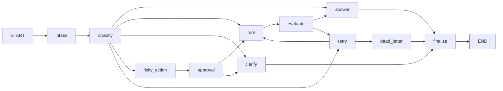

# Day 08 Lab Report

## 1. Team / student

- Name: TODO
- Repo/commit: TODO
- Date: TODO

## 2. Architecture

The workflow uses a typed LangGraph state and eleven bounded nodes. Requests pass through
`intake` and `classify`, then follow the `simple`, `tool`, `missing_info`, `risky`, or `error`
route. Every terminal route passes through `finalize` before `END`. Tool failures use a bounded
retry loop, while risky actions require an approval decision before the tool can run.

## 3. State schema and reducers

| Field group | Reducer | Purpose |
|---|---|---|
| `messages`, `tool_results`, `errors`, `events` | append | Preserve audit history |
| `route`, `risk_level`, `attempt`, `evaluation_result` | overwrite | Control routing |
| `pending_question`, `proposed_action`, `approval`, `final_answer` | overwrite | Hold the current outcome |
| `thread_id`, `scenario_id`, `query`, `max_attempts` | initialized/overwrite | Identify one execution |

## 4. Metrics summary

| Metric | Value |
|---|---:|
| Total scenarios | 7 |
| Success rate | 100.00% |
| Average nodes visited | 6.43 |
| Total retries | 3 |
| Total approvals/interrupts | 2 |
| Persistence resume demonstrated | yes |

## 5. Scenario results

| Scenario | Expected | Actual | Success | Nodes | Retries | Approvals | Latency (ms) | Errors |
|---|---|---|---:|---:|---:|---:|---:|---|
| S01_simple | simple | simple | yes | 4 | 0 | 0 | 3446 | — |
| S02_tool | tool | tool | yes | 6 | 0 | 0 | 1973 | — |
| S03_missing | missing_info | missing_info | yes | 4 | 0 | 0 | 937 | — |
| S04_risky | risky | risky | yes | 8 | 0 | 1 | 1907 | — |
| S05_error | error | error | yes | 10 | 2 | 0 | 3139 | Retry attempt 1 recorded after an unsatisfactory tool result.; Retry attempt 2 recorded after an unsatisfactory tool result. |
| S06_delete | risky | risky | yes | 8 | 0 | 1 | 2839 | — |
| S07_dead_letter | error | error | yes | 5 | 1 | 0 | 865 | Retry attempt 1 recorded after an unsatisfactory tool result. |

## 6. Failure analysis

1. **Transient or malformed tool output:** `evaluate` marks missing or error output for retry.
   `retry` increments the attempt counter and routing sends exhausted work to `dead_letter`,
   preventing an infinite loop or a false successful answer.
2. **Risky action without valid approval:** risky work is prepared but not executed before the
   approval node. A rejected, missing, or malformed decision routes to clarification instead of
   performing a side effect.

## 7. Persistence / recovery evidence

Resume/history evidence must be captured from an actual MemorySaver or SQLite run. Current run
status: **demonstrated**. Record the
thread ID, checkpoint count, test command, and restart/reopen result here before submission.

## 8. Extension work

SQLite persistence, real HITL resume, the Streamlit operations console, and graph evidence should
only be marked complete after their integration tests or demo evidence pass.

## 9. Improvement plan

Prioritize provider timeout handling, durable connection lifecycle management, richer tracing,
and automated clean-environment/Docker smoke tests. Production side effects should also use
idempotency keys so replay after an interrupt cannot duplicate an action.
